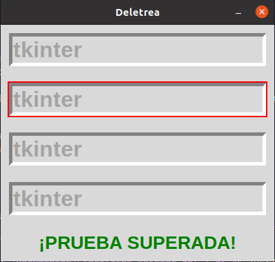
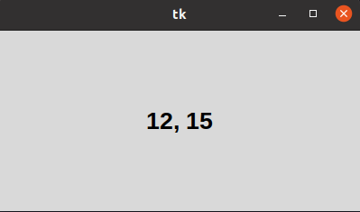
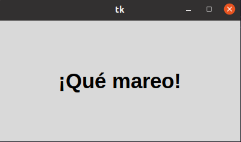

# 3 METODOS COMUNES
## METODOS COMUNES FOCO
### Lo que hacemos es escribir una frase en varias lineas mientras se va moviendo alatoria mente por cada una de ellas 

## METODOS COMUNES POSICION RATON
### Esto nos muestra lo posicion x y y de la posicion de nuestro raon dentro de la ventana 

## METODOS COMNUNES TEMPORIZADORES

## Este metodo nos muestra una palabra o frase que este programada, nos la muestra con una especie de rebota 
