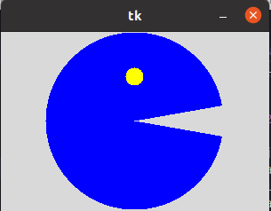
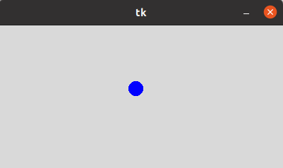
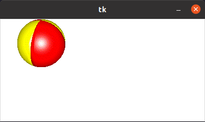
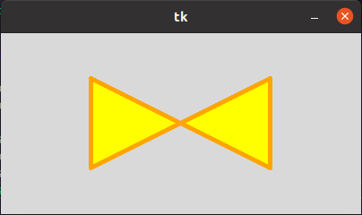
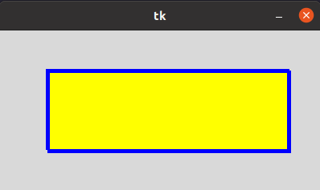
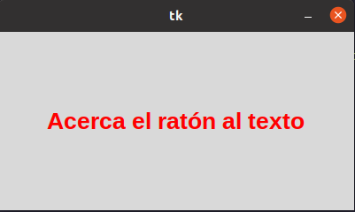

# 5_canvas
## Canvas_arc.py
### En esta ventana podemos hacer figuras geometricas con diferentes diseños dependiendo de lo que tengamos que hacer 

## Canvas_circulo.py 
### En esta ventana se puede observarr como hacer que un objeto rebote cad vez que se choque 

## Canvas_imagen
### En esta ventana al igual que la anterior podemos obsevar una pelota rebotando pero esta vez podemos hacerlo con una imagen

## canvas_lineas.py 
### En la ventana podemos observar unas lineas verticales y horizontales que se hacen atra vez de figuras geometricas 

## Canvas_poligono.py 
### En esta venana podremos observar la opcion de poder hacer figuras geometricas y a que realizaron poligonos

## Canva_rectangulo.py
### En esta ventana sucede lo mismo que con la anteriron si no que a qui arman un rectangulo 

## Canvas_text
### En esta ventana podremos observar la opcion de hacer que cando el mause se pare encima de a frase, la cambie de color 

