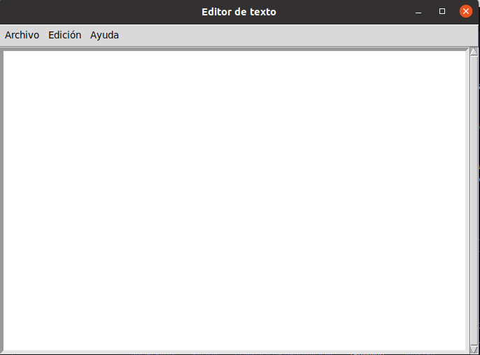

# Ejercicios Widgets

## BUTTON
### Aqui podremos ver un medidor de tiempo por si necesitamos calcular los segundos que pasen 

## Entry 
### Aqui podremos colocar nuestro usuario y contraseña

## Label_reloj 
### Aqui podremos observar un reloj que nos indica la hora a tiempo real 

## Listbox
### Aqui nos mostrara la traduccion de una palabra en 4 diferentes idiomas 

## Menu
### Aqui podremos ver un menu desplegable que a futuro nos servira para añadirle mas cosas 

## Menubutton 
### Esto nos desplegara una ventana que nos mostrara un formulario de nuestra edad, nombre, direccion, etc...

## Messagebox.png
### Este es otro menu  desplegable que es igual al Menubutton

## OptionMenu 
### Aqui podremos ver otro formulario donde tendremos que escribir nuestro nombre, direccion , etc...

## Scale_arco 
### Aqui nos enseñan los angulos de un ciruculo de 0 a 360 grados

## Scroll
### Aqui podremos  observar otro menu que se desplega al momentode iniciar y tendremos diferentes funciones que por el momento no funcionan

## SpinBox
### Aqui nos enseñan otro formulario como los anteriores pero con menos funciones disponibles 

## Text
### Aqui nos enseñan otro menu desplegable 

## Toplevel
### Esto nos muestra una ventana que nos permite acceder a otra ventana donde tendremos que poner un usuario y una contraseña 

