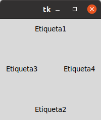
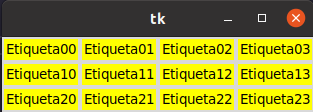
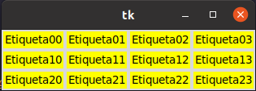
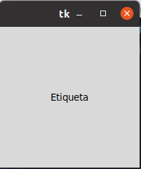

# Ejercicios_tkinter_del_1_al_4
# Gestor de geometria pack

### Este gestor de geometria distribuye los widgets en horizontal o vertical

## Gestor de geometria Grid

### Con grid la distribuicion de los widgets se realiza de una manera mas flexible, utilizando un diseño de cuadricula, De esta manera, cada widget en la celda determinada por la interseccion de una fila y columna 

## Gestor de geometria place

### Este gestor permite colocar los widgets en coordenadas especificas de la ventana principal o del widget contenedor 
